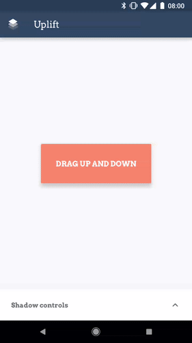

	&emsp;&emsp;&emsp;&emsp;&emsp;
	

While you cannot tint an elevation shadow, you can tweak it in clever ways to obtain subtler shadows,
or simply some specific effect. This can be seen in action in the [Squanchy](http://squanchy.net)
schedule screen, which uses a custom `OutlineProvider` to cast shadows for the cards that look more
like diffuse shadows (although they're very much still the area shadow that the Material guidelines
specify, there is no custom drawing code there).

For more details, you can refer to the [accompanying blogpost](https://blog.usejournal.com/playing-with-elevation-in-android-91af4f3be596).

## More on Uplift
You can test Uplift by downloading it from the [Play Store](https://play.google.com/store/apps/details?id=me.seebrock3r.elevationtester)
or get the apk from the [Releases tab](https://github.com/rock3r/elevation-tester/releases/latest).

## Licence 

See the [`LICENSE`](LICENSE) file. tl;dr it's Apache 2.0

