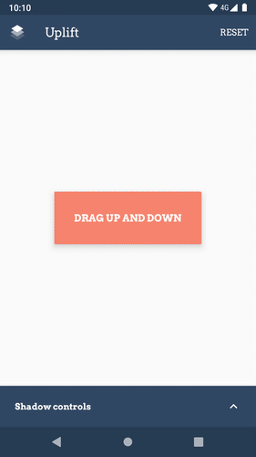
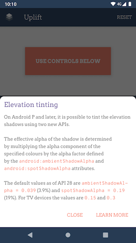

# Uplift  

	&emsp;&emsp;&emsp;&emsp;&emsp;
	

Unbeknownst to most, elevation shadows are actually not completely inflexible. Besides setting the
elevation height itself, you can tweak the shadows in clever ways to obtain subtler shadows,
or simply some specific effect. This can be seen in action in the [Squanchy](http://squanchy.net)
schedule screen, which uses a custom `OutlineProvider` to cast shadows for the cards that look more
like diffuse shadows (although they're very much still the area shadow that the Material guidelines
specify, there is no custom drawing code there).

For more details, you can refer to the [accompanying blogpost](https://blog.sebastiano.dev/playing-with-elevation-in-android/),
and to the follow up posts for Android P: [part 1](https://blog.sebastiano.dev/playing-with-elevation-in-android-part-1/) and
[part 2](https://blog.sebastiano.dev/playing-with-elevation-in-android-part-2/).

### Tinting shadows (Android P+)

Starting with Android P (API 28) you can specify the colour that elevation shadows take on. You can
individually tint the area and the spot shadows — although you probably want the same colour for
both, most of the time. Remember, though, that shadow colours' alphas are premultiplied by a factor
that is defined by the `ambientShadowAlpha` and `spotShadowAlpha` theme attributes, which are set by
default to `0.039` for ambient shadows and `0.19` for spot shadows.

If you want to learn more about it, and learn how to bypass these limitations, you can refer to the
dedicated blog posts, starting with the [first part](https://blog.sebastiano.dev/playing-with-elevation-in-android-part-1/). 

## More on Uplift
You can test Uplift by downloading it from the [Play Store](https://play.google.com/store/apps/details?id=me.seebrock3r.elevationtester)
or get the apk from the [Releases tab](https://github.com/rock3r/elevation-tester/releases/latest).

## Licence

See the [`LICENSE`](LICENSE) file. tl;dr it's Apache 2.0.

The app uses Alessandro Crugnola's [`android-target-tooltip`](https://github.com/sephiroth74/android-target-tooltip) library for
the onboarding, which is licensed under the MIT license.
